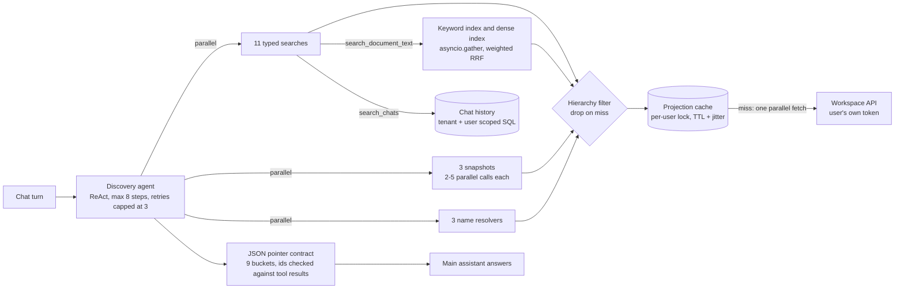

# grep-first-agent

A small "scout" agent that turns vague requests into exact record ids by **searching live workspace data with string matching instead of vector RAG**.

> A clean-room re-implementation of work I designed and built for a production
> multi-tenant AI workspace platform. No employer code; all names and data are fictional.

[](https://github.com/Tayyab-Bilal/grep-first-agent/actions/workflows/ci.yml)

## The problem

Users ask vague questions: "the email where my manager mentioned profit margins", "the Q4
featherfootwear task", "everything about the OPS Manual". The assistant must turn that into **exact
record ids** across many entity types, limited to what this user may see, and fast and cheap enough
to run before every chat turn.

The default answer is vector RAG: embed everything, keep an index in sync. But workspace data is
live, per-user, permission-scoped and full of literal identifiers (names, subjects, senders,
statuses). Those are exact-string problems that embeddings blur. So this scout fetches the user's
live data once, caches it, greps it in memory, and returns pointers. A separate main assistant does
the answering.

## What it does

- **Three layers of tools** (17 here, with chat history wired): 11 typed searches, 3 fallback snapshots, 3 shared name resolvers. `tools.py`, `fallback.py`
- **Grep cascade**: phrase, then tokens, then fuzzy, ranked by a tuple so long text cannot drown an exact match. `matching.py`
- **Hybrid document-text search**: keyword and dense searches run in parallel, fused by weighted RRF. `docsearch.py`, `rrf.py`
- **Hierarchy filtering**: every result is limited to the projects the user may see; a miss is dropped. `hierarchy.py`
- **Strict pointer contract**: exactly 9 typed buckets; unknown buckets are rejected. `contract.py`
- **Completeness flags**: a partial workflow list is marked partial, never passed off as the whole set.
- **Stampede-safe cache**: per-user lock, jittered TTL, never caches empty, error or partial results. `cache.py`
- **Reliability**: one JSON repair turn, retries capped at 3 per tool, pinned-context shortcut, hallucinated-id filter, never raises into the chat turn. `agent.py`
- **Security**: impersonation guard, telemetry scrubbing, credentials never in tool schemas. `security.py`

## Quickstart

```bash
uv venv .venv && uv pip install -e ".[dev]"
.venv/bin/pytest -q
.venv/bin/python examples/demo.py
```

The demo runs vague queries through a full agent run (scripted fake model, no network). Excerpt:

```text
17 tools: 11 typed searches, 3 fallback snapshots, 3 name resolvers

> 'Q4 featherfootwear task'
  task      t1 (Q4 featherfootwear campaign brief)

> 'launch plan'
  task      t2 (Launch plan), t3 (Launch plan)
  ask user: Which task do you mean: 'Website Relaunch > Launch plan' or 'Mobile App Beta > Launch plan'?

backend fetches: 1  (4 queries x 11 searches, one cached projection)

Hierarchy filter: the API also returned a violation from a project Alice cannot see.
  search_violations('supplier contract') -> []

Document text (hybrid keyword + dense in parallel, weighted RRF). Nothing says 'outage':
  d1 OPS Manual: hybrid 0.25 | Incidents are triaged by the operations team.
```

## Usage guide

Run the agent with a scripted model (swap in any LangChain chat model with tool calling for real use):

```python
import asyncio
import json

from langchain_core.messages import AIMessage

from grep_first_agent import DiscoveryAgent, FakeWorkspaceAPI, ProjectionCache, make_tools
from grep_first_agent.fake_model import ScriptedModel, tool_turn

api = FakeWorkspaceAPI()
tools = make_tools(api, ProjectionCache(api), "token-alice")  # the token is closed over, not a tool argument
answer = {"intent": "find", "confidence": 0.9,
          "pointers": {"task": [{"id": "t5", "name": "Update OPS Manual section 4", "confidence": 0.9}]}}
model = ScriptedModel([
    tool_turn(("search_tasks", {"query": "ops manual"}), ("search_meetings", {"query": "ops manual"})),
    AIMessage(content=json.dumps(answer)),
])
result = asyncio.run(DiscoveryAgent(model, tools).run("ops manual"))
assert [p.id for p in result.pointers["task"]] == ["t5"]
```

Call one tool directly. Hits are compact pointers, and results never include other users' or
out-of-hierarchy records:

```python
import asyncio
import json

from grep_first_agent import FakeWorkspaceAPI, ProjectionCache, make_tools

api = FakeWorkspaceAPI()
tools = {t.name: t for t in make_tools(api, ProjectionCache(api), "token-alice")}
hits = json.loads(asyncio.run(tools["search_violations"].ainvoke({"query": "supplier contract"})))
assert hits == []  # the backend returned it, the hierarchy filter dropped it
```

The pointer contract has nine buckets and rejects anything else:

```python
from pydantic import ValidationError

from grep_first_agent import DiscoveryResult

DiscoveryResult(intent="x", pointers={"kpi": [{"id": "k1", "name": "Incident response time"}]})
try:
    DiscoveryResult(intent="x", pointers={"people": []})
except ValidationError:
    pass
else:
    raise AssertionError("unknown bucket accepted")
```

More (pinned context, impersonation, custom indexes, Redis, logging) in [docs/usage.md](docs/usage.md).
Every public class and function is listed in [docs/api.md](docs/api.md).

## How it works



The flow of one run:

1. **Pinned shortcut.** If the request pins a project or document, those records are looked up
   directly and the run ends: no model turn, no scan.
2. **Fan out.** The model calls every relevant tool in one step. Tools run with `asyncio.gather`.
   All typed searches share one cached projection, so 11 tool calls cost one backend fetch.
3. **Filter.** Every tool result passes the hierarchy filter. Records outside the user's projects,
   or with no project, are dropped.
4. **Retry or stop.** A failed or empty tool may be retried; after 3 bad results the agent refuses
   to call it again.
5. **Contract.** The model replies with JSON only. Prose around it is tolerated, content blocks are
   read, and bad JSON gets exactly one repair turn.
6. **Check.** Pointers whose ids no tool returned this run are dropped. Two strong matches with the
   same name produce a clarifying question built from breadcrumb paths. Partial lists are flagged.

## Design decisions

1. **Grep, not embeddings, for structured entities.** Names, senders and subjects are quoted or
   half-remembered literals. String matching finds them reliably, with no embedding bill and no
   index to sync. *Rejected:* vector search for everything, which blurs exact identifiers.
2. **Search only what the user's own call returned.** Permissions come from the data path itself.
   *Rejected:* a shared index with per-chunk ACL filtering.
3. **Tuple ranking, not a weighted sum.** `(phrase_hit, token_hits, fuzzy)` means a long text with
   many soft hits cannot outrank an exact match. *Rejected:* summing scores.
4. **Vectors only inside document text, and lexical leads.** Weighted RRF (k=60, keyword 3 : dense 1),
   dense hits under 0.45 dropped, a 0.20 relevance floor, best two snippets per document.
   *Rejected:* dense-first fusion.
5. **Drop on miss in the hierarchy filter.** If a record's project is unknown or outside the set, hide
   it. The original leak came from showing records that failed the check. *Rejected:* "show unless
   proven forbidden".
6. **The scout never answers the user.** A strict JSON pointer contract with 9 typed buckets keeps
   callers simple. *Rejected:* free-form buckets, which let a model invent `people`.
7. **Parallel by default; missing an entity is worse than over-fetching.** This sentence is in the
   shipped system prompt, and the loop runs requested tools with `asyncio.gather`.
   *Rejected:* one tool at a time, which was the slow path.
8. **Retries capped at 3 per tool.** A flaky tool must not burn the iteration budget. The cap is
   enforced in code, not just asked for in the prompt.
9. **Never cache empty, error or partial results.** A bad projection cached for 5 minutes is a
   5-minute outage. TTL has jitter so users do not all refetch on the same tick.
10. **Completeness flags.** Workflow search pages through an API and reports `complete`, `fetched`
    and `total`, so a partial list is never presented as the whole set.
11. **Telemetry scrubbing.** Logs get tool results with snippets removed and email addresses masked.
12. **Impersonation guard.** A background call acting as a user proceeds only when the ambient tenant
    and user match the claimed ones.
13. **Credentials in closures.** The model sees tools with one `query` argument; the token is never in
    a schema or a cache key (keys use a hash).
14. **Graph RAG was evaluated and rejected** in the original system: the existing data model is
    already the graph, the tools are the traversals and the model is the planner. A separate graph
    service added sync races, unreliable model-written queries and permissions implemented twice.
15. **Prose is capped at 200 characters** before it reaches the model; long descriptions add latency
    and rarely help tell records apart.

### Validated later

I built this on 1 May 2026. Two papers then reported the same finding for agentic search: grep-style
direct corpus interaction beats vector retrieval.
[arXiv:2605.05242](https://arxiv.org/abs/2605.05242) (3 May 2026, "Beyond Semantic Similarity:
Rethinking Retrieval for Agentic Search via Direct Corpus Interaction") and
[arXiv:2605.15184](https://arxiv.org/abs/2605.15184) (14 May 2026, "Is Grep All You Need? How Agent
Harnesses Reshape Agentic Search").

## In production

These are results of the **original system**, not measurements from this repo.

- **Scale of the tool set:** 17 tools over 9 entity types: 14 typed searches plus 3 fallback
  snapshots, and 3 more name-resolution tools shared with other agents. A 15th typed search
  (dashboards) was switched off after a live A/B test showed it fully overlapped another specialist.
- **Size:** about 4.7k lines of agent code and about 2.1k lines in the composite data layer.
- **Speed:** parallel tools cut a cross-entity query from 30+ s to 8-16 s.
- **Cache:** it collapsed 14 parallel tool calls into 1 backend round-trip per user per 5 minutes,
  and fixed cache poisoning and cross-worker inconsistency left by per-process dictionaries.
- **Cost:** about $0.076 per run (19-21k tokens) on a mid-tier model; the scout ran on a cheaper
  model tier because it is high-frequency.
- **Quality:** 24 of 24 live end-to-end cases after review fixes; 55 unit tests.
- **Role:** it became the grounding layer for both chat and autonomous plans. A planner step rejected
  any scope id the discovery pass had not returned.

What this repo simplifies or leaves out:

| Production | This repo |
|---|---|
| Live REST backend | `FakeWorkspaceAPI`, seeded and in memory |
| Keyword and dense searches against a vector database with hosted embeddings | `FakeKeywordIndex` and `FakeDenseIndex` (synonym-folded word counts) |
| Postgres `ILIKE` plus `pg_trgm` for past chats | SQLite `LIKE` plus Python fuzzy ranking |
| Redis cache shared by workers | `InMemoryBackend` by default; `RedisBackend` tested with fakeredis |
| 14 typed searches (adds attachments, profile, onboarding) | 11 typed searches |
| Repair turn: a post-model hook forced exactly one extra graph turn | Repair turn is one extra model call in a plain loop (same behaviour, different mechanism) |
| The model turns ambiguity into a clarifying question | The question is built in code from breadcrumb paths when the model supplies none |
| Real chat model, temperature 0.2 | A scripted fake; use temperature 0.2 when wiring a real model |
| Timezone from token claims, per-loop HTTP clients, pooled HTTP/2 client | Not modelled |
| Chat orchestrator tool and planner integration | Not modelled |

Not claimed: regex *search* (regex is used only for tokenising and scrubbing), and anything about
routing layers or cache invalidation, which other engineers built.

## Testing

```bash
.venv/bin/pytest -q
```

No network, no API keys, under 10 seconds.

| Invariant | Test |
|---|---|
| Phrase beats long fuzzy text; typos found; stopwords are not hits | `tests/test_matching.py` |
| Weighted RRF 3:1, dense floor, per-document aggregation | `tests/test_rrf.py` |
| Keyword and dense run in parallel; dense finds what keywords miss | `test_keyword_and_dense_searches_run_in_parallel`, `test_document_text_finds_meaning_the_keywords_miss` |
| Three tool layers; snapshots fan out in parallel | `tests/test_tool_layers.py` |
| Violation search never returns an out-of-hierarchy item (leak regression) | `test_violation_search_never_returns_item_from_outside_hierarchy` |
| Drop on miss; shared index never leaks | `test_record_with_no_project_is_dropped_on_miss`, `test_hybrid_document_text_never_leaks_*` |
| Exactly 9 buckets; unknown rejected | `test_exactly_nine_typed_buckets`, `test_unknown_bucket_is_rejected` |
| Prompt says parallel by default and over-fetch | `test_system_prompt_says_parallel_by_default_and_over_fetch` |
| Retries capped at 3 | `test_retries_capped_at_three_per_tool` |
| Partial workflow list flagged | `test_partial_workflow_list_*` |
| Pinned context skips the scan | `test_pinned_context_skips_global_scan` |
| Logs have no snippets or addresses | `test_agent_logs_never_contain_snippets_or_addresses` |
| Impersonation needs matching ambient identity | `test_impersonated_call_*` |
| 20 concurrent callers, 1 fetch; jitter; partial never cached | `tests/test_cache.py` |
| One repair turn; hallucinated ids dropped; never raises | `tests/test_agent.py` |
| Docs snippets run | `tests/test_docs.py` |

## Limits & known trade-offs

- The cache lock is per process. With several workers each may fetch once per TTL; add a short Redis
  lock if worker count makes that matter.
- `SequenceMatcher` is quadratic, so fuzzy scoring looks at the first 200 characters of a field.
  Use `rapidfuzz` for large projections.
- Stopwords are English only. Arabic tokenises correctly but has no stopword list.
- SQLite `LIKE` folds case for ASCII only; Postgres `ILIKE` handles Unicode. A pure-typo chat query
  fuzzy-ranks only the user's 500 most recent chats.
- One fuzzy threshold (0.6) is used for all kinds; production tuned 0.55-0.65 per kind.
- The fake dense index is a bag of words with a tiny synonym table. It shows the fusion, not
  embedding quality.
- Workflow paging stops after 3 pages and says so; it does not keep going.
- The pinned lookup trusts the ids the caller passes; it only checks visibility.
- Retries are counted per tool name, per run.

## Project layout

```text
src/grep_first_agent/
  agent.py       ReAct loop, retries cap, pinned shortcut, repair turn, id filter, clarifying question
  tools.py       make_tools: typed searches, assembles all 17 tools; make_pin_resolver
  fallback.py    describe_* snapshots (parallel fan-out) and resolve_* name resolvers
  docsearch.py   fake keyword and dense indexes for document text
  rrf.py         weighted reciprocal-rank fusion and hybrid_content_search
  hierarchy.py   drop-on-miss visibility filter
  matching.py    phrase, token and fuzzy cascade with tuple ranking
  contract.py    DiscoveryResult, 9-bucket Kind, tolerant JSON parsing
  cache.py       per-user projection cache (lock, jitter, no partial caching), Redis backend
  chat_history.py  past-chat search, tenant and user scoped
  security.py    impersonation guard, telemetry scrubbing
  items.py       compact pointer shape shared by tools and agent
  backend.py     WorkspaceAPI protocol and FakeWorkspaceAPI
  seed.py        fictional Acme data for two users
  fake_model.py  scripted chat model for tests and demos
tests/           one file per area, plus test_docs.py that runs doc snippets
examples/demo.py end-to-end walkthrough
docs/            usage.md, api.md
```

## License

MIT
